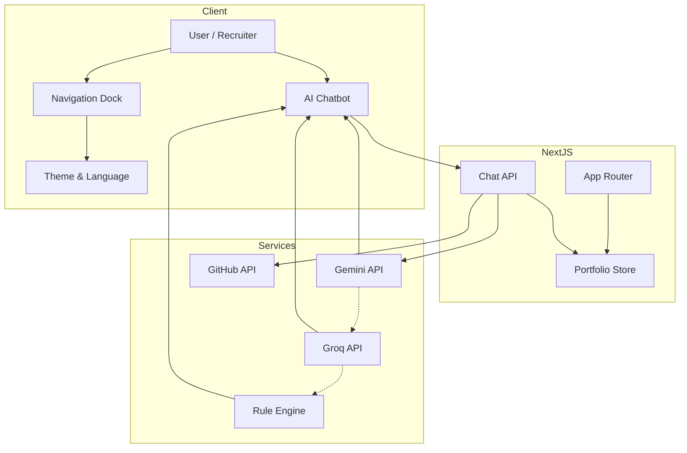
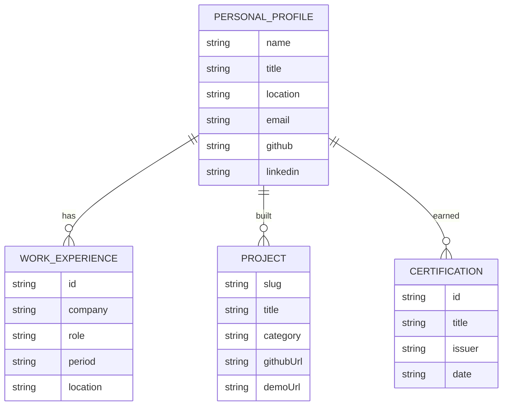

# Dev-Workspace | Vivek's Portfolio & AI Companion

[](https://nextjs.org/)
[](https://react.dev/)
[](https://www.typescriptlang.org/)
[](https://tailwindcss.com/)
[](https://www.framer.com/motion/)
[](https://opensource.org/licenses/MIT)

A modern, high-performance developer portfolio built with **Next.js 16**, **React 19**, and **Tailwind CSS**. Features an integrated **AI Assistant** (powered by Google Gemini & Groq LLMs), real-time bilingual support (English / Hindi), a dark/light theme engine, and a responsive floating navigation dock.

---

## Features & Highlights

- **Recruiter-Grade AI Companion**: Built-in intelligent AI assistant that answers general technical questions first (e.g., ERC-20 standards, Web3 architecture, dApps) before connecting back to Vivek's portfolio experience.
- **Bilingual Localization (EN / HI)**: Instant language toggle supporting English & Hindi across all sections, projects, and AI responses.
- **Responsive Floating Navigation Dock**: Desktop & mobile dock with grouped quick links (`Home`, `Resume`, `LinkedIn`, `AI Assistant`, `Email`, `Language`, `Theme`).
- **Work Experience & Accordion**: Interactive career timeline featuring MotionCut and Digihero internships with expandable bullet points.
- **Featured Projects Showcase**: Detailed project cards and dedicated pages for **BodhAI** (AI Learning Platform), **Web3 DApps**, and **Healthcare AI**.
- **Certifications & Gallery**: Filterable awards section (Oracle OCI AI Foundations, Shaastra IIT Madras, Hackathons) and interactive image gallery.
- **Technical Writings & Blog**: Built-in developer blog with search and categorization.
- **Built for Performance**: Powered by Next.js 16 Turbopack with 100% static prerendering and dynamic API routes.

---

## System Architecture & Data Flow Diagram (DFD)

The following flow diagram illustrates client-server interactions, localization state management, and the multi-tier AI LLM orchestration engine within the application.



---

## Portfolio Data Model (ER Diagram)

The portfolio's data structure model details the relationships between Vivek's personal profile, experiences, projects, certifications, and technical stack.



---

## Tech Stack

- **Framework**: [Next.js 16](https://nextjs.org/) (App Router) + [React 19](https://react.dev/)
- **Language**: [TypeScript](https://www.typescriptlang.org/)
- **Styling**: [Tailwind CSS](https://tailwindcss.com/)
- **Animations**: [Framer Motion](https://www.framer.com/motion/)
- **Icons**: [Lucide React](https://lucide.dev/), React Icons, Simple Icons
- **AI Integration**: Google Gemini API (`gemini-1.5-flash`), Groq API (`llama-3.3-70b-versatile`)
- **State & Theme**: `next-themes`, React Context (Language Provider)

---

## Getting Started

### 1. Clone the Repository

```bash
git clone https://github.com/webdeveloperdesigner/vkworkspace.git
cd vkworkspace
```

### 2. Install Dependencies

```bash
npm install
```

### 3. Environment Setup

Create a `.env.local` file in the root directory:

```env
# AI Assistant API Keys
GEMINI_API_KEY=your_gemini_api_key_here
GROQ_API_KEY=your_groq_api_key_here
```

### 4. Run Development Server

```bash
npm run dev
```

Open [http://localhost:3000](http://localhost:3000) in your browser.

---

## Production Build

```bash
npm run build
npm run start
```

---

## Project Structure

```text
├── src/
│   ├── app/                    # Next.js App Router pages & API routes
│   │   ├── page.tsx            # Main Portfolio Homepage
│   │   ├── achievements/       # Certifications & Honors page
│   │   ├── api/chat/           # AI Assistant backend API endpoint
│   │   ├── blog/               # Developer blog pages
│   │   ├── contact/            # Contact page
│   │   ├── experience/         # Career timeline page
│   │   ├── gallery/            # Project & event gallery page
│   │   ├── projects/           # Projects list & detail pages
│   │   └── skills/             # Hard & soft skills matrix page
│   ├── components/             # Reusable UI components
│   │   ├── chatbot-drawer.tsx  # Floating AI Assistant interface
│   │   ├── navigation-dock.tsx # Bottom floating navigation bar
│   │   ├── header-clock.tsx    # Monospace real-time IST clock
│   │   └── language-provider.tsx# Global EN/HI localization provider
│   └── lib/
│       ├── data.ts             # Centralized portfolio data (Projects, Skills, Experience)
│       └── dictionary.ts       # Bilingual translations dictionary
├── public/                     # Static assets & images
└── README.md
```

---

## Contact & Links

- **Email**: [vivekcsed22@gmail.com](mailto:vivekcsed22@gmail.com)
- **LinkedIn**: [linkedin.com/in/vivek-vns](https://www.linkedin.com/in/vivek-vns/)
- **GitHub**: [github.com/webdeveloperdesigner](https://github.com/webdeveloperdesigner)
- **LeetCode**: [leetcode.com/u/Vivek_cs](https://leetcode.com/u/Vivek_cs/)
- **Codeforces**: [codeforces.com/profile/Vivek_csed](https://codeforces.com/profile/Vivek_csed)

---

Developed by **Vivek**.
